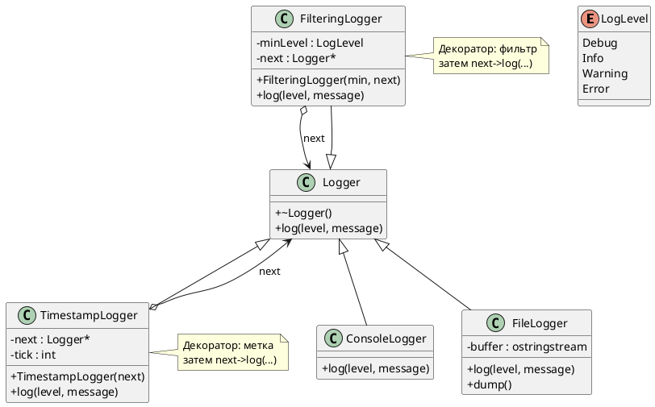
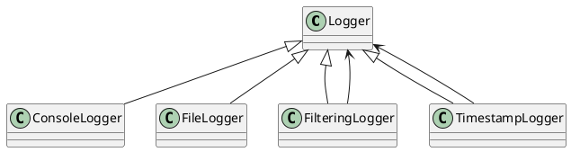

# Воркшоп «Цепочка логгеров»: наследование, виртуальность, декоратор через композицию

## Что такое логирование (кратко для первого знакомства)

**Логирование** — это **осознанная запись того, что происходит в программе во время работы**: какие шаги выполнились, с какими данными, были ли ошибки. Записи называют **логами** (log — «журнал», «протокол»), а код, который их пишет, часто называют **логгером** (logger).

### Зачем это нужно, если есть `std::cout`

На первых лабораторных достаточно `std::cout << "здесь 1\n"`. В реальной программе так быстро становится неудобно:

| Проблема «разбросанного» `cout` | Что даёт логирование |
|--------------------------------|----------------------|
| Сообщения не отличить по важности | **Уровни** (отладка, информация, предупреждение, ошибка) — можно фильтровать шум |
| В релизе нельзя выключить отладочный вывод | Настройка: в продакшене писать только серьёзное |
| Всё идёт в консоль | Разные **приёмники**: консоль, файл, сеть (в учебной модели — консоль и буфер «как файл») |
| В каждом месте свой формат строки | Общий **интерфейс** `log(уровень, текст)` — единый стиль записей |

Логирование — не замена отладчику (breakpoint, просмотр переменных), а **дополнение**: особенно полезно, когда ошибка проявляется редко, на чужой машине или после долгой работы программы — остаётся **история** того, что успело произойти.

### Уровни серьёзности

В этом воркшопе уровень задаётся перечислением **`LogLevel`**:

| Уровень | Типичный смысл | Пример |
|---------|----------------|--------|
| **Debug** | Подробности для разработчика | «вошли в функцию, size=42» |
| **Info** | Нормальный ход работы | «пользователь вошёл», «файл открыт» |
| **Warning** | Подозрительно, но программа продолжает работу | «диск почти заполнен» |
| **Error** | Сбой операции или неверные данные | «не удалось открыть конфиг» |

Чем «серьёзнее» уровень, тем реже такие сообщения должны появляться в обычной работе и тем внимательнее к ним относятся при разборе инцидента.

### Куда пишут лог

- **Консоль** — удобно при разработке: сразу видно вывод.
- **Файл** — удобно на сервере: лог переживает перезапуск терминала, его можно отправить в поддержку.
- В продакшене часто **несколько приёмников сразу** (и в файл, и в систему мониторинга).

В воркшопе **`ConsoleLogger`** моделирует консоль, **`FileLogger`** — накопление в буфер с выводом через `dump()` (упрощённая замена файла).

### Цепочка логгеров — зачем она в этой задаче

В реальных библиотеках (например, spdlog, Boost.Log) одно сообщение часто проходит **несколько шагов**:

1. добавить метку времени или имя модуля;
2. отбросить слишком «мелкие» уровни для этого окружения;
3. записать в файл или консоль.

Каждый шаг — отдельное **звено**. В коде воркшопа звенья — классы **`TimestampLogger`**, **`FilteringLogger`**, затем «лист» **`FileLogger`** или **`ConsoleLogger`**. Сообщение передаётся по цепочке вызовом **`next->log(...)`** — это и есть учебная модель паттерна **«Декоратор»** плюс **полиморфизм** через базовый **`Logger`**.

Схема для этой лабораторной:

```text
  emit / pipeline.log
         │
         ▼
  TimestampLogger   ← добавляет [t=N]
         │ next->log
         ▼
  FilteringLogger   ← пропускает только level >= порог
         │ next->log
         ▼
  FileLogger / ConsoleLogger   ← конечная запись
```

### Связь с темой лекции (наследование)

Здесь наследование нужно не «ради диаграммы», а чтобы:

- любой узел цепочки можно было передать как **`Logger&`** (клиент не знает, фильтр это или консоль);
- **`override`** подставлял своё поведение на каждом звене;
- при необходимости **`dynamic_cast`** восстановил конкретный тип листа (например, вызвать **`dump()`** у `FileLogger`).

Множественное наследование в этом воркшопе **не** используется: следующее звено связано **указателем** `next`, а не второй базой — так проще разделить «тип узла» и «следующий обработчик».

---

## Цель воркшопа

В одной программе собрать:

- полиморфный базовый класс **`Logger`** (`virtual` деструктор, `virtual log`);
- **одиночное наследование:** «листья» **`ConsoleLogger`** и **`FileLogger`**;
- **декораторы** на том же базовом типе: **`FilteringLogger`**, **`TimestampLogger`** — внутри **указатель** на следующий узел (`Logger* next`), без множественного наследования;
- **`override`** и **делегирование** `next->log(...)` вместо копирования логики соседей;
- сравнение **«лист»** (сам пишет) и **«прокладка»** (меняет/фильтрует и передаёт дальше);
- сборку **цепочки** в `main`: `TimestampLogger` → `FilteringLogger` → `FileLogger`;
- свободную функцию **`emit(Logger&, ...)`** — клиент не знает, сколько звеньев в цепочке;
- **`dynamic_cast`**: восстановить `ConsoleLogger*` / `FileLogger*` от `Logger*`; понять, почему от **головы** цепочки до `FileLogger` каст **не** сработает.
- перечисление **`enum class LogLevel`** и функция **`levelLabel`** (см. шаг 1).

Ниже после таблиц заданий — блоки **«Обоснование элементов»**.

---

## Диаграмма классов (PlantUML)



Компактная схема:



---

## Шаг 0. Заготовка

1. Подключите `<iostream>` и `<string>`.
2. Минимальный `main` с `return 0;`.

**Проверка:** пустая программа компилируется.

### Обоснование элементов шага 0

| Элемент | Зачем |
|--------|--------|
| `#include <iostream>` | Вывод логов и отладочных сообщений фильтра. |
| `#include <string>` | Текст сообщений. |
| Базовый `main` | Компиляция после каждого шага. |

---

## Шаг 1. `LogLevel` и вспомогательная функция

Добавьте перечисление **`enum class LogLevel`** со значениями **`Debug`**, **`Info`**, **`Warning`**, **`Error`** (порядок важен для сравнения `level < minLevel` в фильтре).

Реализуйте свободную функцию **`const char* levelLabel(LogLevel level)`**, возвращающую короткие строки вроде `"DEBUG"`, `"INFO"`, …

**Проверка:** в `main` можно временно вывести `levelLabel(LogLevel::Error)`.

### Обоснование

| Элемент | Зачем |
|--------|--------|
| `enum class` | Строгая типизация уровня; не смешивается с `int` без явного приведения. |
| Порядок перечислителей | В C++ значения идут по возрастанию — фильтр «не ниже Warning» пишется как `level < minLevel`. |
| `levelLabel` | Единое человекочитаемое имя уровня во всех логгерах без дублирования `switch`. |

### Перечисление `LogLevel` — что именно зафиксировано в туториале

| Вопрос | Как в этом воркшопе |
|--------|---------------------|
| Синтаксис | **`enum class LogLevel { Debug, Info, Warning, Error };`** — перечисление с областью видимости имён: снаружи пишут **`LogLevel::Info`**, а не голое **`Info`**. |
| Отличие от `enum LogLevel` без `class` | У старого `enum` имена перечислителей попадали в окружающую область видимости и легко конфликтовали с другими идентификаторами; **`enum class`** этого не делает. |
| Числовые значения по умолчанию | Если не задавать вручную (`Debug = 10`), первому перечислителю соответствует **0**, следующему **1**, и т.д. Здесь: `Debug`→0, `Info`→1, `Warning`→2, `Error`→3. Стандарт гарантирует **неубывающий** порядок при объявлении слева направо. |
| Зачем порядок именно такой | В **`FilteringLogger`** используется сравнение **`level < minLevel`**: при **`minLevel == LogLevel::Warning`** сообщения **`Debug`** и **`Info`** имеют **меньшее** целочисленное представление и считаются «слабее порога» — **отбрасываются**; **`Warning`** и **`Error`** — **не меньше** порога (в смысле «не слабее») — **пропускаются** дальше по цепочке. |
| Нужны ли операторы `<` для `enum class` | Для перечислителей одного типа в C++ определены **`operator==`**, **`operator!=`**, **`operator<`**, **`operator>`**, **`operator<=`**, **`operator>=`** (сравнение по «сквозному» целочисленному значению). Поэтому **`level < minLevel`** корректно без своего кода. |
| Явный базовый тип (по желанию) | Можно написать **`enum class LogLevel : std::uint8_t { ... };`** — экономия памяти; в воркшопе не требуется. |
| `levelLabel` и `switch` | После всех **`case`** в эталоне остаётся **`return "?"`** — для компилятора это исчерпывающий возврат; при добавлении нового уровня в `enum` **`switch`** напомнит забытый **`case`**, если включён соответствующий уровень предупреждений. |

---

## Шаг 2. Класс `Logger`

| Элемент | Требование |
|--------|------------|
| Деструктор | **`virtual`**, можно **`= default`**. |
| `log` | **`virtual void log(LogLevel level, const std::string& message)`**; реализация по умолчанию — нейтральный вывод вроде `[log][LEVEL] сообщение`. |

**Проверка:** `Logger l; l.log(LogLevel::Info, "тест");`

### Обоснование класса `Logger`

| Элемент | Зачем |
|--------|--------|
| `virtual ~Logger()` | Без него `delete` через `Logger*` мог бы не вызвать деструктор производного. |
| Виртуальный `log` | Один интерфейс для листьев и декораторов; вызов через `Logger&` идёт в фактический тип. |
| Дефолтная реализация `log` | Запасной вариант и демонстрация, что база не обязана быть «чисто абстрактной». |
| `const std::string& message` | Текст не копируется на границе вызова без необходимости. |

---

## Шаг 3. `ConsoleLogger : public Logger`

| Элемент | Требование |
|--------|------------|
| `log` | **`override`**; префикс вроде `[console][INFO] ...` в `std::cout`. |

**Проверка:** объект `ConsoleLogger`, несколько уровней.

### Обоснование

| Элемент | Зачем |
|--------|--------|
| **`public Logger`** | Консольный логгер **подтип** `Logger` — можно передать в `emit`. |
| `override` | Явная связь с виртуальной функцией; ошибки сигнатуры ловятся компилятором. |
| «Лист» цепочки | Сам выполняет работу, **никуда не делегирует**. |

---

## Шаг 4. `FileLogger : public Logger`

| Элемент | Требование |
|--------|------------|
| Данные | буфер накопления (в эталоне — **`std::ostringstream`**; подключите `<sstream>`). |
| `log` | **`override`** — дописывает строку в буфер с меткой уровня. |
| `dump` | **`const`**-метод: печатает содержимое буфера (учебная замена чтения файла). |

**Проверка:** две записи, затем `dump()`.

### Обоснование

| Элемент | Зачем |
|--------|--------|
| Буфер вместо файла на диске | Фокус на наследовании, а не на I/O; результат цепочки виден в консоли через `dump`. |
| `dump` не в базе | Специфика «файлового» листа; для доступа — объект `FileLogger` или `dynamic_cast`. |

---

## Шаг 5. `FilteringLogger : public Logger` (декоратор)

| Элемент | Требование |
|--------|------------|
| Поля | **`LogLevel minLevel`**, **`Logger* next`** (невладеющий указатель). |
| Конструктор | принимает порог и указатель на следующий узел (может быть `nullptr` для эксперимента). |
| `log` | **`override`**: если `level < minLevel` — сообщение **не** передавать в `next` (в эталоне дополнительно печатается `[filter] отброшено ...`); иначе **`next->log(level, message)`**. |

**Проверка:** `FilteringLogger f(LogLevel::Warning, &console);` — `Info` отбрасывается, `Error` доходит до консоли.

### Обоснование

| Элемент | Зачем |
|--------|--------|
| Наследование от `Logger` | Декоратор **тоже** `Logger` — на него можно повесить `Logger&` и строить цепочку. |
| `Logger* next` | **Композиция** «следующее звено»; не путать с наследованием «следующий класс». |
| Сравнение `level < minLevel` | Простое правило «пропускать только серьёзное». |
| Делегирование `next->log` | Виртуальный вызов: если `next` — `ConsoleLogger`, сработает его `override`. |

---

## Шаг 6. `TimestampLogger : public Logger` (второй декоратор)

| Элемент | Требование |
|--------|------------|
| Поля | **`Logger* next`**, счётчик меток (в эталоне — **`int tick`**, старт с 1). |
| `log` | **`override`**: сформировать строку с префиксом `[t=N]`, увеличить счётчик, вызвать **`next->log(level, stamped)`**. |

**Проверка:** `TimestampLogger` → `ConsoleLogger`; две записи — метки `t=1`, `t=2`.

### Обоснование

| Элемент | Зачем |
|--------|--------|
| Изменение `message` до делегирования | Декоратор **обогащает** данные, не заменяя нижние уровни. |
| Счётчик `tick` | Учебная «метка времени» без `<chrono>`. |

---

## Шаг 7. Функция `emit`

```cpp
void emit(Logger& logger, LogLevel level, const std::string& message);
```

Внутри — **`logger.log(level, message)`**.

**Проверка:** передайте голову цепочки из шага 8 — клиент не знает, есть ли фильтр и файл.

### Обоснование

| Элемент | Зачем |
|--------|--------|
| `Logger&` | Любой узел и любая собранная цепочка подходят под один API. |
| Аналог `dispatch(Vehicle&)` | Тот же приём «сервисная функция + ссылка на базу». |

---

## Шаг 8. Сборка цепочки в `main`

Последовательно добавьте блоки (с заголовками в консоли, как в эталоне):

1. **Прямые листья:** `ConsoleLogger`, `FileLogger` + `dump`.
2. **Фильтр → консоль:** `FilteringLogger(LogLevel::Warning, &backConsole)`.
3. **Метка → фильтр → файл:**
   - на стеке `FileLogger fileSink`;
   - `FilteringLogger severityGate(LogLevel::Warning, &fileSink)`;
   - `TimestampLogger pipeline(&severityGate)`;
   - несколько `pipeline.log(...)` разных уровней;
   - `fileSink.dump()` — в буфере только то, что прошло фильтр (с метками времени в тексте).
4. **`Logger& root = pipeline;`** и **`emit(root, LogLevel::Error, "...")`**.
5. **`dynamic_cast<ConsoleLogger*>`** от указателя на консольный лист — успех.
6. **`dynamic_cast<FileLogger*>`** от `&fileSink` — успех, вызов `dump`.
7. **`dynamic_cast<FileLogger*>`** от `&pipeline` — **неудача** (`nullptr`): голова — `TimestampLogger`, не файл.

**Проверка:** вывод согласуется с правилами фильтра и порядком декораторов.

### Обоснование фрагментов `main`

| Фрагмент | Зачем |
|--------|--------|
| Объекты на стеке | Владелец узлов — `main`; указатели `next` не удаляют соседей. |
| Порядок `Timestamp` → `Filter` → `File` | Сначала метка, потом отсев по уровню, потом запись в буфер. |
| `Logger& root = pipeline` | Полиморфный вызов с головы цепочки. |
| Успешный `dynamic_cast` к листу | Доступ к `dump()` и к методам, которых нет у `Logger`. |
| Неудачный cast от головы | `dynamic_cast` не «видит сквозь» цепочку — только **динамический тип указателя**. |

---

## Шаг 9 (опционально). Владение и `unique_ptr`

Обсудите (можно в комментарии, без обязательной реализации): почему в учебной версии **`Logger* next`** невладеющий; как изменилась бы схема с **`std::unique_ptr<Logger>`** и кто владеет листом.

### Обоснование

| Элемент | Зачем |
|--------|--------|
| Невладеющий `*` | Проще на первом проходе; риск висячего указателя, если лист уничтожен раньше. |
| `unique_ptr` | Явное владение цепочкой; цена — правила копирования и порядок уничтожения. |

---

## Связь с эталоном `workshop_logger_chain_solution.cpp`

| Фрагмент эталона | Шаг |
|------------------|-----|
| `LogLevel`, `levelLabel` | 1 |
| `Logger` | 2 |
| `ConsoleLogger` | 3 |
| `FileLogger` | 4 |
| `FilteringLogger` | 5 |
| `TimestampLogger` | 6 |
| `emit` | 7 |
| Блоки `main` | 8 |

---

## Контрольный чек-лист

- [ ] `Logger`: виртуальный деструктор, виртуальный `log`.
- [ ] `ConsoleLogger` / `FileLogger`: `override`, листья без `next`.
- [ ] `FilteringLogger` / `TimestampLogger`: `next`, делегирование `next->log`.
- [ ] Цепочка из трёх звеньев и осмысленный `dump` файлового буфера.
- [ ] `emit(Logger&, ...)`.
- [ ] Успешный и неуспешный `dynamic_cast` — понимание, почему от головы нельзя получить `FileLogger*`.

---

## Дополнительные задания

1. Добавьте декоратор **`PrefixLogger`**, добавляющий фиксированный префикс приложения (`"[App] "`).
2. Сделайте **`FilteringLogger`** без сообщения «отброшено» — только тихий пропуск.
3. Замените `int tick` на строку времени из **`<chrono>`** (формат `HH:MM:SS`).
4. Сравните эту схему с **множественным наследованием** ролей (как `RoboTruck`) — когда декоратор уместнее, чем MI.

---

## Связь с другими воркшопами курса

| Идея | RoboTruck | Цепочка логгеров |
|------|-----------|------------------|
| Полиморфная база | `Autonomous` | `Logger` |
| Расширение поведения | MI (`Truck` + `Autonomous`) | Цепочка указателей `next` |
| Делегирование | `Autonomous::navigate` | `next->log` |
| `dynamic_cast` | к `RoboTruck*` | к `FileLogger*` / неудача с головы |
