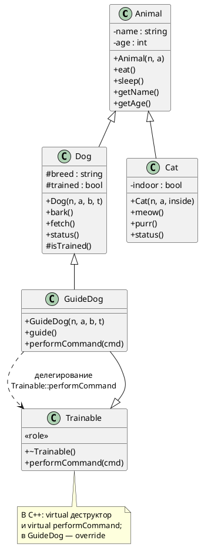
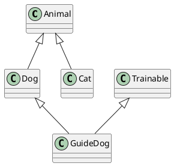

# Лабораторная: пошаговое создание иерархии (наследование, виртуальность, сокрытие имён)

## Цель лабораторной

В одной программе собрать:

- одиночное наследование: `Dog` и `Cat` от `Animal`;
- доступ `public` / `protected` / `private`;
- **невиртуальные** методы базы и вызовы через ссылку на базу (**статическое** связывание);
- отдельный полиморфный интерфейс **`Trainable`** (виртуальный деструктор, виртуальная команда);
- **множественное наследование:** `GuideDog : Dog, Trainable`;
- **`override`**, делегирование в базу через **`Trainable::performCommand(...)`**;
- ссылки на **подобъекты** одного и того же `GuideDog`;
- **`dynamic_cast`** от полиморфной базы;
- осознанное отличие **сокрытия имён** от **переопределения виртуальной функции**.

Ниже в каждом шаге после таблицы задания идёт блок **«Обоснование элементов»** — зачем в модели нужен каждый член класса и каждое ключевое слово.

---

## Диаграмма классов (PlantUML)

Ниже — **PlantUML**-скрипт целевой модели по завершении лабораторной. Его можно вставить в [plantuml.com/plantuml](https://www.plantuml.com/plantuml), в плагин PlantUML для IDE или в документ, который собирает диаграммы из fenced-блоков `plantuml`.

Упрощённый вариант без полей (только отношения наследования), если нужна минимальная схема на слайд:

---

## Шаг 0. Заготовка файла

1. Подключите `<iostream>` и `<string>`.
2. Оставьте пустой или минимальный `main` с `return 0;` — вы будете расширять его по мере появления классов.

**Проверка:** пустая программа компилируется.

### Обоснование элементов шага 0

| Элемент | Зачем |
|--------|--------|
| `#include <iostream>` | Вывод в консоль для демонстрации поведения методов без отдельного фреймворка. |
| `#include <string>` | Имя, порода, команды — текстовые; `std::string` даёт безопасное управление буфером в отличие от сырого `char*`. |
| Пустой `main` | Точка входа обязана существовать; минимальный каркас позволяет компилировать проект после каждого маленького изменения. |

---

## Шаг 1. Класс `Animal`

Создайте класс **`Animal`** со следующим контрактом:

| Элемент | Требование |
|--------|------------|
| Данные | кличка и возраст; **не** делайте их `public` — спрячьте в `private`. |
| Конструктор | принимает `const std::string&` (имя) и `int` (возраст); инициализирует поля в списке инициализации. |
| `eat`, `sleep` | константные методы без параметров; печатают, что это животное **по имени** ест или спит. Используйте `std::cout`. |
| Геттеры | `getName()` → `std::string`, `getAge()` → `int`; оба `const`. |

**Намеренно:** не объявляйте `eat` и `sleep` как **`virtual`**. Это важно для последующих шагов про статический тип.

**Проверка:** в `main` создайте `Animal` и вызовите `eat`, `sleep`, геттеры (можно только вывести значения).

### Обоснование элементов класса `Animal`

| Элемент | Зачем в модели и в учебном плане |
|--------|----------------------------------|
| Поле «кличка» (`std::string`, `private`) | Идентичность животного в выводе; **private**, чтобы внешний код не мог сменить имя обходом инвариантов класса и чтобы производные классы не «росли» от прямого доступа к полю — они пользуются контролируемым API (`getName`). |
| Поле «возраст» (`int`, `private`) | Атрибут состояния; сокрыт по той же причине, что и кличка: изменения только через методы, если вы их позже добавите. |
| Конструктор `Animal(const std::string&, int)` | Гарантирует, что объект **сразу** валидно инициализирован (нет «пустого зверя» без имени). `const std::string&` избегает лишнего копирования больших строк при вызове; внутри поле всё равно обычно копируется в член класса. |
| Список инициализации в конструкторе | Инициализация полей до входа в тело конструктора; для `std::string` — предсказуемое заполнение без двойной работы. |
| `void eat() const` / `void sleep() const` | Общее поведение любого животного; **`const`** у методов фиксирует контракт «не меняют видимое состояние объекта» (для простой модели достаточно; при расширении счётчиков приёмов пищи `const` пришлось бы пересмотреть). |
| **Без** `virtual` у `eat` / `sleep` | Учебный контраст с `Trainable`: через `Animal&` вызов всегда идёт в **`Animal`**, что демонстрирует **статическое** связывание и готовит к теме сокрытия имён, если в `Dog` позже появится свой `eat`. |
| Явный деструктор не обязателен | Компилятор сгенерирует невиртуальный `~Animal`; для этой лаборатории удаление через `Animal*` не демонстрируется намеренно, чтобы не смешивать с полиморфным удалением через `Trainable*`. |
| `getName() const` → `std::string` | Возврат **по значению** даёт копию строки — вызывающий не получает ссылку на `private`-данные и не может менять состояние извне. |
| `getAge() const` → `int` | Тот же принцип контролируемого чтения; `int` достаточен для учебной модели. |
| Секция `public` у конструктора и методов | Клиентский код создаёт животное и просит действия; геттеры — единственный законный способ читать скрытые поля для подклассов и внешнего кода в этой схеме. |

---

## Шаг 2. Класс `Dog : public Animal`

Добавьте **`Dog`**, публично наследующий **`Animal`**.

| Элемент | Требование |
|--------|------------|
| Поля | порода (`std::string`) и признак дрессировки (`bool`). Часть данных сделайте **`protected`**, чтобы производный класс мог ими пользоваться, а произвольный внешний код — нет (см. шаг 6). |
| Конструктор | параметры: имя, возраст, порода, признак дрессировки. Явно вызовите конструктор **`Animal`** в списке инициализации. |
| Поведение | `bark`, `fetch` — константные методы с осмысленным выводом (используйте `getName()` из базы). |
| `status` | константный метод: выводит кличку, породу, возраст (через `getAge()`), флаг дрессировки человекочитаемо («да»/«нет»). |
| Вспомогательно | константный **`protected`**-метод, возвращающий признак дрессировки (например `isTrained()`), — он понадобится `GuideDog`. |

**Проверка:** `Dog d("...", возраст, "порода", true);` — `d.eat()`, `d.bark()`, `d.status()`.

### Обоснование элементов класса `Dog`

| Элемент | Зачем |
|--------|--------|
| **`public Animal`** | Отношение «собака — животное» для клиента: публичный интерфейс `Animal` остаётся доступен снаружи; это модель подтипа (Liskov на уровне интерфейса), а не реализация «внутри». |
| `breed` (**`protected`**, не `public`) | Порода нужна в `status` и потенциально в `GuideDog`, но **не** обязана быть частью внешнего API: `protected` даёт доступ **только** наследникам и самому `Dog`, снижая связность с остальным кодом. |
| `trained` (**`protected`**) | Флаг дрессировки — внутреннее состояние для логики «можно ли отдавать служебные команды»; наружу его не выставляем, но **`GuideDog`** должен читать его через `isTrained()`, не ломая инкапсуляцию `bool` прямым доступом извне. |
| Конструктор с четырьмя параметрами | Соответствует смыслу: имя и возраст — атрибуты животного, порода и дрессировка — атрибуты именно собаки. |
| Вызов `Animal(n, a)` в списке инициализации | **Обязанность** производного класса: подобъект базы инициализируется до членов `Dog`; без этого имя и возраст не были бы заданы корректно. |
| `bark` / `fetch` (**`const`**) | Специфика собаки; не меняют состояние в учебной модели; имя берётся через **`getName()`**, потому что `name` в базе недоступен напрямую — это демонстрирует правильное использование инкапсуляции базы. |
| `status` (**`const`**, `public`) | Диагностический вывод «кто я»; публичен, чтобы клиент мог запросить состояние без знания внутренних полей. |
| `isTrained() const` (**`protected`**) | Наследник (`GuideDog`) должен решать политику команд, но произвольный `main` не должен дергать флаг напрямую: один контролируемый метод чтения лучше, чем `public bool trained`. |

---

## Шаг 3. Класс `Cat : public Animal` (вторая ветвь)

Добавьте **`Cat`**, публично наследующий **`Animal`**. Связи наследования с `Dog` **нет** — только общий предок `Animal`.

| Элемент | Требование |
|--------|------------|
| Данные | например, признак «домашняя / на улице» (`bool`). |
| Конструктор | имя, возраст, ваш признак; база инициализируется как у `Dog`. |
| Поведение | минимум два метода на выбор (например «мяу», «мурлычет») с выводом в консоль. |
| `status` | свой вывод: кличка, возраст, ваш признак в читаемом виде. |

**Вопрос для себя:** переопределяет ли `Cat::status` метод `Dog::status`? Почему нет?

**Проверка:** объект `Cat`, вызовы методов базы и своих.

### Обоснование элементов класса `Cat`

| Элемент | Зачем |
|--------|--------|
| **`public Animal`** | Кошка моделируется как другое подмножество животных с тем же базовым контрактом `eat`/`sleep`/имя/возраст. |
| Поле `indoor` (или аналог, часто **`private`**) | Деталь, не нужная снаружи иерархии: в эталоне оно `private`, чтобы наружу торчали только методы; если сделать `protected`, обоснуйте это заранее (расширение иерархии от `Cat`). |
| Конструктор `(имя, возраст, признак)` | Единая схема с `Dog`: общие параметры базы плюс специфика вида. |
| Два поведенческих метода (например `meow`, `purr`) | Показывают, что вторая ветвь добавляет **свой** протокол, не связанный с `bark`/`fetch`. |
| `status` в `Cat` | **Не** `override` к `Dog::status`: у `Cat` и `Dog` нет отношения база–производный друг к другу — это **два независимых** метода с одинаковым именем в разных классах; совпадение имени — про удобство API, а не про полиморфизм. |

---

## Шаг 4 (теория + мини-эксперимент). Сокрытие имён

**Сокрытие** (`name hiding`): если в производном классе объявить функцию с тем же именем, что у базы (даже с другой сигнатурой), обычный поиск имени может **не дойти** до перегрузок базы.

Сделайте **временный** эксперимент (потом можно откатить):

1. В `Dog` добавьте **невиртуальный** метод `eat()` (любое тело, отличное от базы).
2. В `main` для объекта `Dog` вызовите `eat()` без квалификатора. Убедитесь, какая версия вызывается.
3. Попробуйте вызвать версию **`Animal::eat`** извне объекта `Dog` «в лоб» — что говорит компилятор?
4. Исправьте ситуацию одним из способов: **`using Animal::eat;`** в `Dog` или явный вызов **`Animal::eat()`** внутри вашего `Dog::eat`, или удалите эксперимент.

Зафиксируйте вывод: **без `virtual`** «новый `eat` в производном» — это не полиморфное переопределение, а в первую очередь вопрос имён и области видимости.

### Обоснование элементов эксперимента

| Элемент | Зачем в учебном смысле |
|--------|------------------------|
| Новый `Dog::eat` без `virtual` | Показывает разницу с полиморфизмом: имя `eat` в области `Dog` «перекрывает» имя базы для неуточнённого вызова. |
| `using Animal::eat;` | Восстанавливает **перегрузочный набор** имён из базы в производном классе — стандартный идиоматический приём. |
| Вызов `Animal::eat()` внутри `Dog::eat` | Явная **квалификация базой**: обход сокрытия для делегирования («сначала наша логика, потом обычное поедание»). |

---

## Шаг 5. Класс `Trainable`

Введите класс **`Trainable`** как отдельную **роль** («существо, которому можно отдавать команды»), **не** наследующую `Animal`.

| Элемент | Требование |
|--------|------------|
| Деструктор | объявите **`virtual`** и определите как `= default` (или явное тело — по желанию курса). |
| `performCommand` | принимает `const std::string&`; объявите **`virtual`**; реализация по умолчанию печатает нейтральное сообщение вроде «выполняю команду: …». |

**Проверка:** `Trainable t; t.performCommand("тест");` — пока без `GuideDog`.

### Обоснование элементов класса `Trainable`

| Элемент | Зачем |
|--------|--------|
| **Независимость от `Animal`** | Роль «поддаётся дрессировке» не сводится к биологии: в реальности команды могли бы быть у других сущностей; в коде это отделяет **полиморфный контракт команд** от иерархии зверей. |
| `virtual ~Trainable() = default` | Если когда-либо объект `GuideDog` уничтожается через `Trainable*`, цепочка деструкторов должна дойти до `GuideDog` и `Dog`. Без `virtual` в базе вызвался бы только `~Trainable` — **неопределённое поведение** при полиморфном удалении. `= default` оставляет поведение «как сгенерировано», но участвует в виртуальном механизме. |
| `virtual void performCommand(const std::string& cmd)` | Единая точка полиморфизма для «как выполняется команда»; реализация в базе — **дефолтное** поведение для «просто дрессируемого»; `GuideDog` подставит свою логику. |
| Параметр `const std::string&` | Команда не копируется при каждом вызове с временной строкой лишний раз на границе вызова в типичных случаях; внутри можно использовать как есть. |
| Публичный интерфейс | Роль вызывается из клиентского кода через ссылку/указатель на `Trainable`; скрывать команду за `protected` здесь не требуется — это не миксин-реализация, а публичный протокол. |

---

## Шаг 6. Класс `GuideDog : public Dog, public Trainable`

Реализуйте **множественное наследование:** `GuideDog` одновременно собака и дрессируемая роль.

| Элемент | Требование |
|--------|------------|
| Конструктор | те же параметры, что у `Dog`; в списке инициализации достаточно явно вызвать **`Dog(...)`** (подобъект `Trainable` пока можно оставить с неявным конструктором по умолчанию). |
| `guide` | константный метод с выводом, что эта собака ведёт хозяина (имя через `getName()`). |
| `performCommand` | пометьте **`override`** (сигнатура должна совпадать с виртуальной в `Trainable`). Логика: если собака **не** дрессирована (используйте **`protected`** API из `Dog`), вывести сообщение о неготовности и **выйти** без вызова базовой команды; иначе вывести осмысленный префикс (например, имя и роль «поводырь»), затем **делегировать** в реализацию **`Trainable`**, вызвав её **квалифицированным именем** — `Trainable::performCommand(cmd)`, чтобы не уйти в бесконечную рекурсию и явно использовать код базы. |

**Проверка:** создайте `GuideDog` с `trained == true`, вызовите методы `Animal`, `Dog`, `guide`, `performCommand`.

### Обоснование элементов класса `GuideDog`

| Элемент | Зачем |
|--------|--------|
| **`public Dog`, `public Trainable`** | Обе роли **публичны**: клиент должен видеть и собачий API (`bark`, `fetch`, …), и роль команд (`performCommand`) без лишних адаптеров. Другой моделью было бы `private` наследование роли — здесь сознательно выбран **подтип** по обеим осям для учебной демонстрации MI. |
| Конструктор только с параметрами `Dog` | Поводырь **есть собака** с именем, возрастом, породой и флагом дрессировки; отдельных полей «имя поводыря» не вводим, чтобы не дублировать данные `Animal` внутри `Dog`. |
| Вызов `Dog(...)` в списке инициализации | Единственная явная инициализация «смысловой» базы; `Trainable` инициализируется неявно дефолтным конструктором — достаточно, пока у `Trainable` нет обязательных параметров. |
| `guide() const` | Специфика **поводыря**, не общая для всех `Dog`: выносится только в `GuideDog`. `const`, так как сценарий не меняет состояние в учебной модели. |
| `performCommand(...) override` | Явная связь с виртуальным методом `Trainable`; **`override`** ловит ошибки сигнатуры на этапе компиляции. |
| Ветка `if (!isTrained())` | Бизнес-правило: недрессированная собака не должна вести себя как готовый к служебным командам поводырь; ранний `return` **не** вызывает базовую «нейтральную» команду — иначе смысл отказа размывался бы. |
| Префикс в `cout` перед делегированием | Отделяет вывод **контекста поводыря** от универсальной строки `Trainable`. |
| `Trainable::performCommand(cmd)` | **Квалифицированный вызов:** берётся реализация именно базы, без повторного виртуального вызова, который снова попал бы в `GuideDog` и дал бы бесконечную рекурсию. Это же отличается от вызова через указатель на `Trainable`, где диспетчеризация снова выбрала бы `GuideDog`. |

---

## Шаг 7. Свободная функция `feed`

Объявите и определите **`void feed(const Animal& a)`**, внутри которой вызывается **`a.eat()`**.

**Проверка:** передайте в `feed` объект типа **`GuideDog`** (без приведения типов). Убедитесь, что вызывается **`Animal::eat`** (при отсутствии сокрытия имён в `Dog`/`GuideDog`).

Сформулируйте: почему при невиртуальном `eat` выбор функции определяется **статическим** типом ссылки `const Animal&`, а не фактическим типом `GuideDog`.

### Обоснование элементов `feed`

| Элемент | Зачем |
|--------|--------|
| Свободная функция (не метод) | Моделирует внешний сервис «покормить любое животное»; зависимость только от **`Animal`**, а не от конкретного зоопарка классов. |
| Параметр `const Animal&` | Принимается и `Animal`, и `Dog`, и `GuideDog` без среза объекта; **`const`** — кормление не требует изменять зверя. |
| Тело `a.eat()` | При **невиртуальном** `eat` имя функции разрешается по **статическому** типу `Animal&` → всегда `Animal::eat`; это ключевой контраст с шагом 8 для `performCommand`. |

---

## Шаг 8. Расширьте `main`: ссылки на подобъекты и полиморфизм

Используя один объект **`GuideDog argus(...)`** (дрессированный), последовательно добавьте в `main`:

1. Прямые вызовы: питание, сон, лай, апорт, `status`, команда, `guide`.
2. Блок с заголовком в консоли: создайте **`Trainable& asTrainable = argus;`** и вызовите **`asTrainable.performCommand(...)`**. Ожидание: сработает логика **`GuideDog::performCommand`** (виртуальный вызов).
3. **`Animal& asAnimal = argus;`** — вызов **`asAnimal.eat()`** и вызов **`feed(argus)`**.
4. **`Dog& asDog = argus;`** — вызов, например, **`bark`**.
5. **`Trainable* trainPtr = &argus;`** — виртуальный вызов `performCommand` через указатель.
6. **`dynamic_cast<GuideDog*>(trainPtr)`** — если результат не `nullptr`, вызовите **`guide()`** через полученный указатель.
7. Вызов **`argus.Trainable::performCommand("...")`** с какой-нибудь строкой. Сравните вывод с обычным **`argus.performCommand("...")`**: объясните, что даёт **квалифицированное имя базы** (обход динамической диспетчеризации к `GuideDog`).

**Проверка:** программа компилируется; вывод соответствует ожиданиям по пунктам выше.

### Обоснование каждого фрагмента в `main` (шаг 8)

| Фрагмент | Зачем |
|--------|--------|
| Объект `GuideDog argus(...)` | Полный тип: видны все методы всех публичных баз без приведений — «реальная жизнь» использования объекта целиком. |
| Прямые вызовы `eat`, `sleep`, … | Показывают унаследованные и собственные операции без среза; статический тип здесь совпадает с динамическим. |
| `Trainable& asTrainable = argus` | **Срез ссылки** на подобъект: статический тип ссылки — `Trainable`, динамический тип объекта — `GuideDog`; готовит к виртуальному вызову. |
| `asTrainable.performCommand(...)` | **Виртуальный** выбор реализации по динамическому типу → `GuideDog::performCommand`. |
| `Animal& asAnimal = argus` | Подобъект/проекция на «животное»; через неё видны только операции `Animal` (плюс зависимости от видимости). |
| `asAnimal.eat()` | Статический тип `Animal&`, `eat` не виртуальный → **`Animal::eat`** (если не было сокрытия имени). |
| `feed(argus)` | Неявное связывание с `const Animal&`: то же статическое разрешение `eat`. |
| `Dog& asDog = argus` | Проекция на «собаку»: видны `Dog` и `Animal`, но не интерфейс `Trainable` без приведения. |
| `asDog.bark()` | Демонстрация собачьего API через ссылку на базу `Dog`. |
| `Trainable* trainPtr = &argus` | Адрес подобъекта `Trainable` может **не совпадать** с адресом начала `GuideDog` — нормально для MI; указатель нужен для `dynamic_cast` и для вызова через базу. |
| `trainPtr->performCommand(...)` | Ещё раз виртуальный вызов через указатель. |
| `dynamic_cast<GuideDog*>(trainPtr)` | Безопасное **восстановление полного типа** от полиморфной базы; при неудаче вернёт `nullptr` (здесь должна быть успешной для `argus`). |
| Вызов `guide()` на результате каста | Доказывает, что после приведения доступен API, которого нет у `Trainable`. |
| `argus.Trainable::performCommand("...")` | **Статический** выбор реализации в `Trainable`, минуя `GuideDog::performCommand` — для сравнения вывода и понятия «обход виртуальности». |

---

## Шаг 9. Второй объект `GuideDog` и `Cat`

1. Создайте **`GuideDog`** с **`trained == false`** и вызовите **`performCommand`**. Убедитесь, что срабатывает ветка «не готова».
2. Создайте **`Cat`**, вызовите наследуемые `eat`/`sleep` и свои методы, затем **`status`**.

**Проверка:** полный сценарий собирается и демонстрирует обе ветви иерархии.

### Обоснование этих фрагментов в `main`

| Элемент | Зачем |
|--------|--------|
| Второй `GuideDog` с `trained == false` | Проверка ветки логики в `GuideDog::performCommand`, которую один только «успешный» `argus` не демонстрирует. |
| Объект `Cat` и вызовы | Закрепление **параллельной ветви** `Animal`: тот же базовый контракт, другой производный класс без MI. |

---

## Шаг 10 (опционально). `dynamic_cast` и `Animal`

Попробуйте в закомментированном фрагменте приведение **`dynamic_cast<GuideDog*>(указатель_на_Animal)`**, где **`Animal` без виртуальных функций**.

**Задача:** зафиксировать реакцию компилятора и кратко пояснить в комментарии, почему для **`dynamic_cast` «вниз»** требуется **полиморфная** база, а в этой лаборатории полиморфность сосредоточена в **`Trainable`**.

### Обоснование этого эксперимента

| Элемент | Зачем |
|--------|--------|
| Отказ компиляции / требование полиморфности | `dynamic_cast` в ряде случаев опирается на **run-time type information** у полиморфного типа; без `virtual` в `Animal` проверка «вниз» через `Animal*` в стандартной форме не предоставляется — это связывает синтаксис языка с моделью времени выполнения. |
| Разделение осей `Animal` / `Trainable` | Показывает, что «биология» и «роль» в вашей программе спроектированы с **разной** полиморфной стратегией осознанно, а не по недосмотру. |

---

## Контрольный чек-лист перед сдачей

- [ ] `Animal`: инкапсуляция имя/возраст, невиртуальные `eat`/`sleep`.
- [ ] `Dog` / `Cat`: корректная инициализация базы, разные `status`, вторая ветвь у `Cat`.
- [ ] `Trainable`: `virtual` деструктор, `virtual performCommand`.
- [ ] `GuideDog`: MI, `override`, ветка для недрессированной, `Trainable::performCommand` внутри своей реализации.
- [ ] `main`: срезы `Trainable&`, `Animal&`, `Dog&`, `Trainable*`, `dynamic_cast`, квалифицированный вызов.
- [ ] Понимание разницы: сокрытие имён ↔ виртуальное переопределение; статический тип ↔ динамический тип при вызове.

---

## Дополнительные задания

1. После шага 4 оставьте в `Dog` «проблемный» `eat` и оформите решение через `using Animal::eat;`.
2. Добавьте в `Animal` одну **`virtual`** функцию (например, строковый «вид») и сравните поведение с невиртуальным `eat` при вызове через `Animal&`.
3. Нарисуйте схему подобъектов в памяти для `GuideDog` (концептуально: `Animal` внутри `Dog`, `Dog`, `Trainable`).
