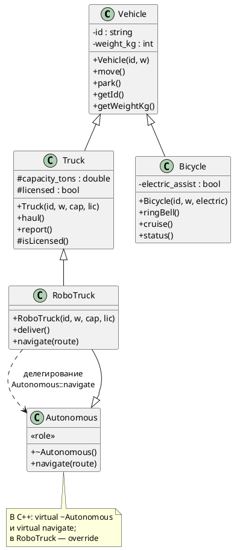
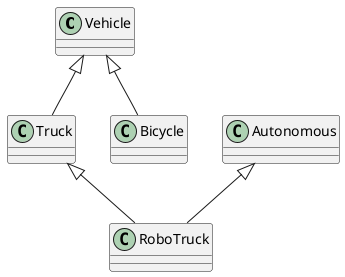

# Воркшоп «RoboTruck»: транспорт, грузовик, роль автономности (MI, виртуальность, `dynamic_cast`)

## Цель воркшопа

В одной программе собрать:

- одиночное наследование: **`Truck`** и **`Bicycle`** от **`Vehicle`**;
- инкапсуляцию данных базы (`private`), расширение грузовика полями в **`protected`** и доступ наследнику через **`protected`**-метод (например **`isLicensed()`**);
- **невиртуальные** методы базы **`move`** / **`park`** и вызовы через ссылку **`const Vehicle&`** (**статическое** связывание);
- отдельный полиморфный интерфейс **`Autonomous`** (виртуальный деструктор, виртуальная **`navigate`**);
- **множественное наследование:** **`RoboTruck : public Truck, public Autonomous`**;
- **`override`**, делегирование в базу через **`Autonomous::navigate(...)`**;
- ссылки на **подобъекты** одного и того же **`RoboTruck`** (`Vehicle&`, `Truck&`, `Autonomous&`);
- **`dynamic_cast`** от полиморфной базы **`Autonomous*`** к **`RoboTruck*`**;
- осознанное сравнение: **квалифицированный вызов базы** `alpha.Autonomous::navigate(...)` **против** обычного **`alpha.navigate(...)`**;
- второй сценарий **`RoboTruck`** **без** лицензии и отдельная ветвь **`Bicycle`** в **`main`**.

Ниже после таблиц заданий идут блоки **«Обоснование элементов»** — зачем в модели каждый член и каждое ключевое слово (по аналогии с лабораторной `lecture_through_example_tutorial.md`).

---

## Диаграмма классов (PlantUML)

Скрипт целевой модели по завершении воркшопа. Его можно вставить в [plantuml.com/plantuml](https://www.plantuml.com/plantuml), плагин PlantUML для IDE или в документ со сборкой диаграмм из fenced-блоков `plantuml`.

Компактная схема (только наследование), удобная для слайда:

---

## Шаг 0. Заготовка файла

1. Подключите `<iostream>` и `<string>`.
2. Оставьте минимальный `main` с `return 0;` — вы будете расширять его по мере появления классов.

**Проверка:** пустая программа компилируется.

### Обоснование элементов шага 0

| Элемент | Зачем |
|--------|--------|
| `#include <iostream>` | Вывод в консоль для демонстрации поведения без отдельного фреймворка. |
| `#include <string>` | Идентификаторы ТС и строки маршрутов; `std::string` безопаснее сырого `char*`. |
| Минимальный `main` | Обязательная точка входа; каркас позволяет компилировать после каждого маленького изменения. |

---

## Шаг 1. Класс `Vehicle`

Создайте класс **`Vehicle`** со следующим контрактом:

| Элемент | Требование |
|--------|------------|
| Данные | идентификатор (`std::string`) и масса в кг (`int`); храните в **`private`**. |
| Конструктор | принимает `const std::string& id` и `int weight_kg`; инициализирует поля в **списке инициализации**. |
| `move`, `park` | **`const`**-методы без параметров; печатают сообщения с **идентификатором** (через поле или геттер — на усмотрение курса; в эталоне внутри `Vehicle` используется `id` напрямую). |
| Геттеры | `getId()` → `std::string`, `getWeightKg()` → `int`; оба **`const`**. |

**Намеренно:** не объявляйте `move` и `park` как **`virtual`**. Это важно для демонстрации **статического** связывания через `Vehicle&` (см. шаг 8).

**Проверка:** в `main` создайте `Vehicle` и вызовите `move`, `park`, геттеры.

### Обоснование элементов класса `Vehicle`

| Элемент | Зачем в модели и в учебном плане |
|--------|----------------------------------|
| `id`, `weight_kg` в **`private`** | Инварианты ТС не раскрываются всему коду; производные классы (`Truck`, `Bicycle`) используют **`getId()`** / **`getWeightKg()`**, что дисциплинирует доступ. |
| Конструктор с двумя параметрами | Объект сразу в осмысленном состоянии («есть номер и масса»). |
| **`const`** у `move` / `park` | В учебной модели методы только печатают; `const` фиксирует контракт «не меняют видимое состояние». |
| **Без** `virtual` у `move` / `park` | Через `Vehicle&` вызов всегда разрешается в **`Vehicle::move`** / **`Vehicle::park`** — контраст с полиморфной осью **`Autonomous`**. |
| `getId()` возвращает **копию** `std::string` | Внешний код не получает ссылку на внутренний буфер и не ломает инкапсуляцию. |
| `getWeightKg()` → `int` | Достаточно для учебной модели массы. |

---

## Шаг 2. Класс `Truck : public Vehicle`

Добавьте **`Truck`**, публично наследующий **`Vehicle`**.

| Элемент | Требование |
|--------|------------|
| Поля | грузоподъёмность в тоннах (`double`) и признак лицензии (`bool`). Часть данных разместите в **`protected`** (как в эталоне: оба поля), чтобы производный **`RoboTruck`** опирался на политику лицензии, не открывая поля миру. |
| Конструктор | параметры: `id`, `weight_kg`, `capacity_tons`, `licensed`. Явно вызовите **`Vehicle`** в списке инициализации. |
| Поведение | `haul` — **`const`**, печатает грузоподъёмность; `report` — **`const`**, выводит id, массу (через **`getWeightKg()`**), тоннаж и «да/нет» по лицензии. |
| Вспомогательно | **`protected`**-метод **`isLicensed() const`**, возвращающий признак лицензии — он понадобится **`RoboTruck`**. |

**Проверка:** создайте `Truck t("...", масса_кг, тоннаж, true);`, вызовите `move`, `haul`, `report`.

### Обоснование элементов класса `Truck`

| Элемент | Зачем |
|--------|--------|
| **`public Vehicle`** | Грузовик моделируется как **подтип** транспорта: клиент видит `move`/`park`/геттеры без обёрток. |
| `capacity_tons`, `licensed` в **`protected`** | Наследнику (`RoboTruck`) нужна политика «можно ли автонавигацию», но произвольному коду не обязательно читать сырые поля. |
| Вызов `Vehicle(id, weight_kg)` в списке инициализации | Корректная инициализация подобъекта базы до полей `Truck`. |
| `haul` / `report` | Специфика грузовика; в выводе используйте **`getId()`** / **`getWeightKg()`**, если не обращаетесь к полям базы напрямую — это согласуется с инкапсуляцией `Vehicle`. |
| `isLicensed() const` в **`protected`** | Единая контролируемая точка чтения флага для `RoboTruck` без `public bool licensed`. |

---

## Шаг 3. Класс `Bicycle : public Vehicle` (вторая ветвь)

Добавьте **`Bicycle`**, публично наследующий **`Vehicle`**. Связи наследования с **`Truck`** **нет** — только общий предок **`Vehicle`**.

| Элемент | Требование |
|--------|------------|
| Данные | например, признак электропомощи (`bool electric_assist`), в эталоне — **`private`**. |
| Конструктор | `id`, `weight_kg`, флаг электропомощи; база инициализируется как у `Truck`. |
| Поведение | минимум два метода (например `ringBell`, `cruise`) с выводом в консоль. |
| `status` | свой вывод: id, масса, текст «с электропомощью» / «без мотора». |

**Вопрос для себя:** переопределяет ли `Bicycle::status` какой-либо метод `Truck`? Почему нет?

**Проверка:** объект `Bicycle`, вызовы методов базы и своих.

### Обоснование элементов класса `Bicycle`

| Элемент | Зачем |
|--------|--------|
| **`public Vehicle`** | Велосипед — другое подмножество транспорта с тем же базовым контрактом «есть id и масса». |
| `electric_assist` **`private`** | Деталь реализации; наружу — только методы и `status`. |
| `ringBell` / `cruise` | Свой протокол, не связанный с `haul`/`report`. |
| `status` | **Не** `override` к `Truck::report`: разные классы, разные имена в эталоне; совпадение идеи «отчёт о себе» не создаёт полиморфной связи между `Truck` и `Bicycle`. |

---

## Шаг 4 (теория + мини-эксперимент). Сокрытие имён (по желанию)

По аналогии с лабораторной про `Animal`/`Dog`: если в производном классе объявить функцию с тем же именем, что у базы, неуточнённый поиск может **не подтянуть** перегрузки базы.

**Опционально:** временно добавьте в `Truck` невиртуальный `move()` с другим телом, вызовите его и базовый `Vehicle::move` через квалификацию или `using Vehicle::move;`, затем откатите изменения, если хотите сохранить эталонную модель без сокрытия.

### Обоснование эксперимента

| Элемент | Зачем в учебном смысле |
|--------|------------------------|
| Дублирующее имя `move` в `Truck` | Иллюстрация **name hiding** и отличия от **`virtual override`**. |
| `Vehicle::move()` или `using Vehicle::move;` | Стандартные приёмы восстановления видимости базовых перегрузок или делегирования. |

---

## Шаг 5. Класс `Autonomous`

Введите класс **`Autonomous`** как отдельную **роль** («умеет вести по маршруту автономно»), **не** наследующую **`Vehicle`**.

| Элемент | Требование |
|--------|------------|
| Деструктор | **`virtual`** и определение **`= default`** (или явное тело). |
| `navigate` | принимает `const std::string& route`; объявите **`virtual`**; реализация по умолчанию печатает нейтральное сообщение о следовании по маршруту. |

**Проверка:** локальный объект `Autonomous a; a.navigate("тест");` — пока без `RoboTruck`.

### Обоснование элементов класса `Autonomous`

| Элемент | Зачем |
|--------|--------|
| **Независимость от `Vehicle`** | Ось «автономность» ортогональна «это транспорт»: в коде отделяется полиморфный контракт навигации от иерархии ТС. |
| `virtual ~Autonomous() = default` | Без этого удаление объекта `RoboTruck` через **`Autonomous*`** было бы опасным (неполная цепочка деструкторов). |
| `virtual void navigate(const std::string& route)` | Точка динамического выбора реализации; база даёт **дефолтное** поведение, `RoboTruck` — свою политику. |

---

## Шаг 6. Класс `RoboTruck : public Truck, public Autonomous`

Реализуйте **множественное наследование:** `RoboTruck` одновременно грузовик и роль автономности.

| Элемент | Требование |
|--------|------------|
| Конструктор | те же параметры, что у `Truck`; в списке инициализации достаточно явно вызвать **`Truck(...)`** (подобъект `Autonomous` — неявно конструктором по умолчанию). |
| `deliver` | **`const`**-метод с выводом про автономную доставку (специфика робогрузовика). |
| `navigate` | пометьте **`override`** (сигнатура как у `Autonomous::navigate`). Логика: если **`!isLicensed()`**, вывести сообщение о блокировке автонавигации и **`return`** **без** вызова базовой навигации; иначе вывести префикс (например id и пометку «робогрузовик»), затем **делегировать** в **`Autonomous::navigate(route)`** квалифицированным именем, чтобы избежать рекурсии. |

**Проверка:** `RoboTruck` с лицензией `true` — вызовы `move`, `haul`, `navigate`, `deliver`.

### Обоснование элементов класса `RoboTruck`

| Элемент | Зачем |
|--------|--------|
| **`public Truck`, `public Autonomous`** | Обе роли публичны: виден и API транспорта/грузовика, и полиморфная навигация. |
| Вызов `Truck(...)` в списке инициализации | Явно задаётся «грузовая» часть; `Vehicle` инициализируется внутри `Truck`. |
| `navigate(...) override` | Связь с виртуальной функцией `Autonomous`; **`override`** ловит ошибки сигнатуры. |
| Ветка без лицензии | Бизнес-правило: без разрешения автономный режим не должен вызывать «базовую» навигацию. |
| `Autonomous::navigate(route)` | **Квалифицированный вызов** реализации базы; обычный виртуальный вызов снова попал бы в `RoboTruck::navigate` → риск бесконечной рекурсии. |

---

## Шаг 7. Свободная функция `dispatch`

Объявите **`void dispatch(const Vehicle& v)`**, внутри вызовите **`v.move()`**.

**Проверка:** передайте в `dispatch` объект **`RoboTruck`** без приведения типов. Убедитесь, что вызывается **`Vehicle::move`** (при невиртуальном `move`).

Сформулируйте: почему выбор функции определяется **статическим** типом `const Vehicle&`, а не фактическим типом `RoboTruck`.

### Обоснование элементов `dispatch`

| Элемент | Зачем |
|--------|--------|
| Свободная функция | Внешний сценарий «отправить любое ТС в движение»; зависимость только от **`Vehicle`**. |
| `const Vehicle&` | Принимается `Vehicle`, `Truck`, `RoboTruck` без среза объекта. |
| `v.move()` | При **невиртуальном** `move` — всегда **`Vehicle::move`** по статическому типу. |

---

## Шаг 8. Расширьте `main`: подобъекты, полиморфизм, `dynamic_cast`

Используя один объект **`RoboTruck alpha(...)`** с лицензией **`true`**, последовательно добавьте:

1. Прямые вызовы: `move`, `park`, `haul`, `report`, `navigate`, `deliver`.
2. Заголовок в консоли и **`Autonomous& asAuto = alpha;`**, затем **`asAuto.navigate(...)`** — ожидайте **`RoboTruck::navigate`** (виртуальный вызов).
3. **`Vehicle& asVehicle = alpha;`** — `asVehicle.move();` и **`dispatch(alpha);`**.
4. **`Truck& asTruck = alpha;`** — например **`haul()`**.
5. **`Autonomous* autoPtr = &alpha;`**, **`autoPtr->navigate(...)`**.
6. **`if (RoboTruck* back = dynamic_cast<RoboTruck*>(autoPtr))`** — при успехе вызовите **`deliver()`**.
7. **`alpha.Autonomous::navigate("...")`** и сравните с **`alpha.navigate("...")`**: что даёт квалифицированное имя базы (обход пользовательской логики `RoboTruck` и проверки лицензии в этой точке вызова).

**Проверка:** компиляция и вывод согласованы с ожиданиями.

### Обоснование фрагментов в `main` (шаг 8)

| Фрагмент | Зачем |
|--------|--------|
| `RoboTruck alpha(...)` | Полный тип: доступны методы обеих публичных баз и собственный `deliver`. |
| `Autonomous& asAuto = alpha` | Ссылка на **подобъект** `Autonomous`; его адрес может **отличаться** от адреса начала `RoboTruck` / подобъекта `Vehicle` — нормально для MI. |
| `asAuto.navigate(...)` | **Виртуальный** выбор → `RoboTruck::navigate`. |
| `Vehicle& asVehicle = alpha` | Проекция на «просто транспорт»; видны `move`/`park`/геттеры. |
| `asVehicle.move()` | Статический тип `Vehicle&`, `move` не виртуальный → **`Vehicle::move`**. |
| `dispatch(alpha)` | Неявная привязка к `const Vehicle&` — то же статическое разрешение. |
| `Truck& asTruck = alpha` | Проекция на грузовик: `haul`, `report`, методы `Vehicle`. |
| `Autonomous* autoPtr = &alpha` | Указатель на полиморфную базу для виртуального вызова и для `dynamic_cast`. |
| `dynamic_cast<RoboTruck*>(autoPtr)` | Безопасное **восстановление полного типа**; при несовместимости — `nullptr`. |
| `alpha.Autonomous::navigate(...)` | **Статический** выбор реализации в `Autonomous`, минуя `RoboTruck::navigate` — полезно для сравнения в консоли и понимания «обхода» виртуальности в конкретном вызове. |

---

## Шаг 9. Второй `RoboTruck` без лицензии и ветвь `Bicycle`

1. Создайте **`RoboTruck beta(..., licensed == false)`** и вызовите **`navigate`**. Убедитесь, что **не** вызывается **`Autonomous::navigate`** (ранний выход в `RoboTruck::navigate`).
2. Создайте **`Bicycle`**, вызовите унаследованные `move`/`park` и свои методы, затем **`status`**.

**Проверка:** полный сценарий демонстрирует обе ветви от `Vehicle` и обе политики лицензии для `RoboTruck`.

### Обоснование этих фрагментов

| Элемент | Зачем |
|--------|--------|
| `beta` без лицензии | Демонстрация ветки «автонавигация заблокирована», которую один только «успешный» `alpha` не показывает. |
| `Bicycle` | Закрепление **параллельной ветви** `Vehicle` без участия в MI с `Autonomous`. |

---

## Шаг 10 (опционально). `dynamic_cast` и невиртуальная база

Попробуйте в закомментированном фрагменте приведение **`dynamic_cast<RoboTruck*>(указатель_на_Vehicle)`**, если у **`Vehicle`** **нет** виртуальных функций.

**Задача:** зафиксировать реакцию компилятора и кратко пояснить в комментарии: для **`dynamic_cast` «вниз»** через указатель обычно требуется **полиморфный** тип в иерархии; в этом воркшопе полиморфность сосредоточена в **`Autonomous`**, а не в **`Vehicle`**.

### Обоснование эксперимента

| Элемент | Зачем |
|--------|--------|
| Требование полиморфности | Связь синтаксиса `dynamic_cast` с RTTI и полиморфными классами в стандарте C++. |
| Разные оси `Vehicle` / `Autonomous` | Осознанный выбор: «транспорт» остаётся с невиртуальным простым API, «автономность» — виртуальная роль. |

---

## Связь с эталоном `workshop_robot_truck_solution.cpp`

| Фрагмент эталона | Шаги туториала |
|------------------|----------------|
| `Vehicle` | 1 |
| `Truck` | 2 |
| `Bicycle` | 3 |
| `Autonomous` | 5 |
| `RoboTruck` | 6 |
| `dispatch` | 7 |
| Блоки `main` с заголовками `--- ... ---` | 8–9 |

Комментарии внутри эталона дублируют и углубляют многие формулировки из таблиц выше — их удобно читать параллельно с этим файлом.

---

## Контрольный чек-лист перед сдачей

- [ ] `Vehicle`: инкапсуляция id/масса, невиртуальные `move`/`park`, геттеры.
- [ ] `Truck`: инициализация базы, `protected` поля/метод `isLicensed`, `haul`/`report`.
- [ ] `Bicycle`: вторая ветвь, свой `status`, методы помимо базы.
- [ ] `Autonomous`: `virtual` деструктор, `virtual navigate`.
- [ ] `RoboTruck`: MI, `override`, ветка без лицензии, `Autonomous::navigate` внутри успешной ветки.
- [ ] `main`: `Autonomous&`, `Vehicle&`, `Truck&`, `Autonomous*`, `dynamic_cast`, квалифицированный вызов базы.
- [ ] Понимание: статический тип ↔ динамический тип; невиртуальный `move` через `Vehicle&` vs виртуальный `navigate` через `Autonomous&`/`*`.

---

## Дополнительные задания

1. Добавьте в `Vehicle` одну **`virtual`** функцию (например, `std::string kind() const`) и сравните поведение с невиртуальным `move` при вызове через `Vehicle&`.
2. Нарисуйте концептуальную схему подобъектов в памяти для `RoboTruck`: `Vehicle` внутри `Truck`, поля `Truck`, подобъект `Autonomous` (без ромба `Vehicle`).
3. Обсудите, как изменилась бы модель, если бы `Autonomous` наследовал `Vehicle` и `RoboTruck` наследовал только `Autonomous` (дублирование / ромб / `virtual` наследование) — без обязательной реализации в коде.
